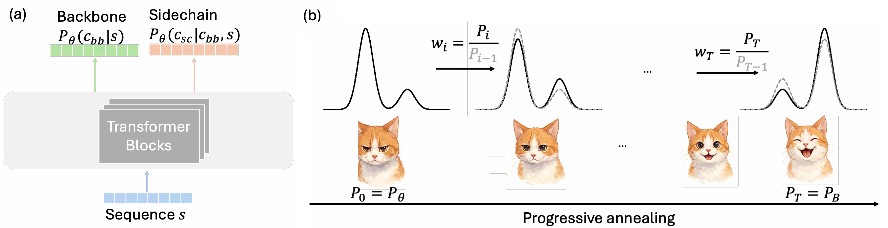

# LangBoltz: All-Atom Protein Ensemble Generation via Boltzmann-Aligned Protein Language Models

[](LICENSE)
[]()
[]()

---

## ✨ Overview

**LangBoltz** is an autoregressive protein language model that aims to efficiently generate protein conformation ensembles following Boltzmann distributions. 


---
## Table of Contents
- [Installation](#-installation)
- [How to Run](#️-how-to-run)
  - [0. Hugging Face Setup](#0-hugging-face-setup)
  - [1. All-atom conformation ensemble generation](#1-run-with-config-file)
    - [1.1 Equilibrium Conformation Ensemble Generation](#11-equilibrium-conformation-ensemble-generation)
  - [2. Boltzmann-alignment](#2-run-with-pyhon-api)
- [Citation](#-citation)
- [Contact](#-contact)
- [License](#-license)

## 🛠 Installation

Clone this repository and create a conda environment:

```bash
git clone https://github.com/Harrydirk41/LangBoltz.git
cd LangBoltz

conda env create -f environment.yml
conda activate LangBoltz_env
```
---

## ▶️ How to Run
### 0. Hugging Face Setup
LangBoltz relies on ESM3 for tokenization. Before running anything, you need to authenticate with Hugging Face to use ESM3. Please refer to https://huggingface.co/EvolutionaryScale/esm3-sm-open-v1 and https://github.com/evolutionaryscale/esm for obtaining tokens

1. **Create a Hugging Face account**  
   [https://huggingface.co/join](https://huggingface.co/join)

2. **Generate a token**  
   Go to https://huggingface.co/EvolutionaryScale/esm3-sm-open-v1 and follow instructions.

3. **Log in (one-time setup)**  
   Run in your terminal and paste your token when prompted:
   ```bash
   huggingface-cli login
### 1. All-atom conformation ensemble generation

This guide explains how to run **all-atom protein conformation ensemble generation** using LangBoltz.  
All sampling modes are configured through YAML files.


#### 1.1 Equilibrium Conformation Ensemble Generation

Edit: `config.yml`

- **num_sample**  
  - Number of conformations to generate.  

- **batch_size**  
  - Adjust based on available GPU memory.  

- **sequence**  
  - Protein sequence

- **protein_name**  
  - Protein name

- **sidechain_ARM**  
  - LangBoltz supports two sidechain generation modules. By setting sidechain_ARM to true you can use the autoregressive generation on sidechain (one torsion angle at a time). This is mainly used is you later need Boltzmann alignment. Otherwises, we recommend setting it to false to generate all tokens at once (much faster).
Finally, run: 
```bash
python LangBoltz_sample.py
```

## 📖 Citation

Paper coming soon!   

---

## 📜 License

This repository is licensed under the [MIT License](LICENSE).
